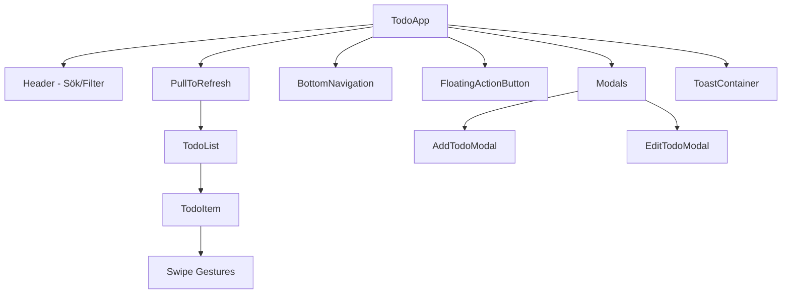

# 🛠️ Development Guide - Zhoplist Shopping List App

Välkommen till utvecklingsguiden för vår mobile-first todo-applikation!

## 🏗️ Projektstruktur

```
zhoplist/
├── frontend/                 # React 18 + TypeScript frontend
│   ├── src/
│   │   ├── components/       # React komponenter
│   │   │   ├── TodoApp.tsx          # Huvudkomponent
│   │   │   ├── TodoList.tsx         # Lista över todos
│   │   │   ├── TodoItem.tsx         # Individuell todo med swipe
│   │   │   ├── AddTodoModal.tsx     # Modal för att skapa todos
│   │   │   ├── EditTodoModal.tsx    # Modal för redigering
│   │   │   ├── Header.tsx           # Sök och filter
│   │   │   ├── BottomNavigation.tsx # Mobile navigation
│   │   │   ├── PullToRefresh.tsx    # Pull-to-refresh wrapper
│   │   │   └── ...
│   │   ├── context/          # React Context för state
│   │   │   └── TodoContext.tsx      # Global app state
│   │   ├── hooks/            # Custom React hooks
│   │   │   ├── useSwipe.ts          # Swipe gestures
│   │   │   └── usePullToRefresh.ts  # Pull-to-refresh logic
│   │   ├── types/            # TypeScript definitioner
│   │   │   └── index.ts             # Alla TypeScript interfaces
│   │   ├── utils/            # Hjälpfunktioner
│   │   │   ├── api.ts               # API service layer
│   │   │   └── mockData.ts          # Test data och mock API
│   │   └── index.css         # Tailwind CSS + custom styles
│   ├── public/               # Statiska filer
│   │   ├── manifest.json            # PWA manifest
│   │   └── ...
│   └── package.json          # Frontend dependencies
│
├── backend/                  # Cloudflare Workers API
│   ├── src/
│   │   └── index.ts                 # Workers entry point med REST API
│   ├── migrations/           # D1 databas migrationer
│   │   └── 0001_initial.sql         # Skapar todos-tabellen
│   ├── wrangler.toml                # Workers konfiguration
│   └── package.json          # Backend dependencies
│
├── README.md                 # Huvuddokumentation
├── DEPLOYMENT.md            # Deployment guide
├── DEVELOPMENT.md           # Denna fil
└── package.json             # Root projekt scripts
```

## 🎯 Arkitektur Översikt

### Frontend Arkitektur



### State Management
- **React Context**: Global state för todos, UI state, toasts
- **useReducer**: Komplex state logic med actions
- **Local State**: Komponent-specifik state (formulär, animations)

### API Layer
```typescript
// API service med automatic fallback till mock data
api.getTodos() → API call → Fallback till mockData vid fel
```

### Mobile UX Patterns
- **Swipe Gestures**: Höger = slutföra, Vänster = ta bort
- **Pull-to-Refresh**: Dra ner listan för att uppdatera
- **Bottom Navigation**: Primära actions i mobile reach-zone
- **FAB**: Quick access för att lägga till todos

## 🚀 Kom Igång med Utveckling

### 1. Setup Miljö
```bash
# Klona och installera allt
git clone <repo>
cd zhoplist
npm run setup

# Eller manuellt:
npm run install:all
npm run setup:db
```

### 2. Starta Development Servers
```bash
# Starta både frontend och backend
npm run dev

# Eller separat:
npm run dev:frontend  # http://localhost:5173
npm run dev:backend   # http://localhost:8787
```

### 3. Test med Mock Data
Om backend inte startar fungerar appen ändå med mock data.

## 🧱 Komponenter Guide

### TodoItem - Swipe Interactions
```typescript
// Använder useSwipe hook för touch gestures
const swipeHandlers = useSwipe({
  onSwipeLeft: () => handleDelete(),   // Ta bort todo
  onSwipeRight: () => handleToggle(),  // Slutföra todo
});

return (
  <div {...swipeHandlers}>
    {/* Todo content */}
  </div>
);
```

### AddTodoModal - Form Handling
```typescript
// Komplett formulär med validering
const [formData, setFormData] = useState<TodoFormData>({
  title: '',
  description: '',
  priority: 0,
  category: '',
  dueDate: '',
  tags: [],
});
```

### PullToRefresh - Mobile Pattern
```typescript
// Wrapper som hanterar pull-to-refresh
<PullToRefresh onRefresh={loadTodos}>
  <TodoList todos={filteredTodos} />
</PullToRefresh>
```

## 🎨 Styling Guide

### Tailwind CSS Classes
```css
/* Glassmorphism effekter */
.glass-surface         /* Frostat glas med backdrop-blur */
.todo-item            /* Standard todo styling */
.todo-completed       /* Genomstrykning för slutförda */

/* Priority indicators */
.priority-low         /* Blå kant */
.priority-medium      /* Gul kant */  
.priority-high        /* Röd kant */

/* Mobile-optimerade buttons */
.btn-primary          /* Primär button med shadow */
.btn-secondary        /* Sekundär glassmorphism button */
.fab                  /* Floating Action Button */
```

### Color Tokens
```javascript
// Se tailwind.config.js
colors: {
  primary: '#6366f1',    // Indigo
  secondary: '#8b5cf6',  // Purple
  background: '#0f172a', // Slate-900
  surface: '#1e293b',    // Slate-800
  success: '#10b981',    // Emerald
  text: '#f1f5f9',       // Slate-100
  muted: '#64748b',      // Slate-500
}
```

## 🔧 API Utveckling

### Backend Structure
```typescript
// Workers entry point
export default {
  async fetch(request: Request, env: Env): Promise<Response> {
    const router = new Router();
    
    // CRUD routes
    router.get('/api/todos', getTodos);
    router.post('/api/todos', createTodo);
    router.put('/api/todos/:id', updateTodo);
    router.delete('/api/todos/:id', deleteTodo);
    router.patch('/api/todos/:id/toggle', toggleTodo);
    
    return router.handle(request);
  }
};
```

### Databas Schema
```sql
-- D1 SQLite schema
CREATE TABLE todos (
  id TEXT PRIMARY KEY,
  title TEXT NOT NULL,
  description TEXT,
  completed BOOLEAN DEFAULT FALSE,
  priority INTEGER DEFAULT 0,  -- 0=low, 1=medium, 2=high
  category TEXT,
  created_at DATETIME DEFAULT CURRENT_TIMESTAMP,
  updated_at DATETIME DEFAULT CURRENT_TIMESTAMP,
  due_date DATETIME,
  tags TEXT  -- JSON array som string
);
```

## 🧪 Testing Strategy

### Frontend Testing
```bash
# Type checking
npm run type-check

# Linting
npm run lint

# Build test
npm run build
```

### API Testing
```bash
# Health check
curl http://localhost:8787/health

# Create todo
curl -X POST http://localhost:8787/api/todos \
  -H "Content-Type: application/json" \
  -d '{"title":"Test todo","priority":1}'
```

### Mock Data Testing
Appen faller automatiskt tillbaka på mock data om API:t inte är tillgängligt:
```typescript
// Se utils/mockData.ts för test data
export const mockTodos: Todo[] = [
  // 8 demo todos med olika prioriteter och kategorier
];
```

## 🚀 Performance Optimering

### Frontend Optimizations
- **Code Splitting**: Automatisk med Vite
- **Tree Shaking**: Tar bort oanvänd kod
- **Asset Optimization**: Komprimering av bilder/CSS
- **Service Worker**: För offline functionality

### Backend Optimizations
- **Edge Caching**: Cloudflare CDN
- **Minimal Runtime**: Optimerad Workers bundle
- **Database Indexing**: Optimerade queries

## 🐛 Debugging Tips

### Frontend Debugging
```javascript
// React DevTools
// Chrome: F12 → Components tab

// Network debugging
// Chrome: F12 → Network tab → Filter: Fetch/XHR

// State debugging
const { state } = useTodo();
console.log('Current state:', state);
```

### Backend Debugging
```bash
# Local Workers logs
npm run dev:backend
# Logs visas i terminalen

# Production logs
npx wrangler tail
```

### Common Issues

1. **CORS Errors**
   - Kontrollera att CORS headers är satta i Workers
   - Verifiera `VITE_API_URL` i frontend

2. **Build Errors**
   - Kontrollera Node.js version (18+)
   - Kör `npm install` i både frontend/ och backend/

3. **D1 Connection Issues**
   - Verifiera `database_id` i `wrangler.toml`
   - Kör migrations: `npx wrangler d1 migrations apply todo-db --local`

## 📈 Feature Development

### Lägga Till Ny Funktion

1. **Planning**
   - Uppdatera types/ om nödvändigt
   - Design API endpoints (backend)
   - Skissa UI/UX (frontend)

2. **Backend First**
   - Lägg till i `backend/src/index.ts`
   - Testa med curl eller Postman
   - Uppdatera databas schema om nödvändigt

3. **Frontend Implementation**
   - Uppdatera `utils/api.ts`
   - Lägg till i Context actions
   - Skapa/uppdatera komponenter
   - Testa med mock data först

4. **Integration Testing**
   - Testa fullständig flow
   - Kontrollera mobile UX
   - Performance test

### Code Style

```typescript
// TypeScript interfaces i types/
export interface NewFeature {
  id: string;
  property: string;
}

// API calls i utils/api.ts
export const api = {
  newFeature: async (): Promise<NewFeature[]> => {
    return tryApiOrMock(
      () => apiRequest<APIResponse<NewFeature[]>>('/api/new'),
      () => mockAPI.getNewFeatures()
    );
  },
};

// Context actions
const handleNewFeature = async () => {
  try {
    const result = await api.newFeature();
    dispatch({ type: 'SET_NEW_FEATURE', payload: result });
  } catch (error) {
    showToast({ type: 'error', title: 'Fel', message: error.message });
  }
};
```

## 🤝 Bidra till Projektet

1. **Fork** repositoriet
2. **Skapa feature branch**: `git checkout -b feature/amazing-feature`
3. **Följ kod-style**: ESLint + Prettier konfiguration
4. **Testa din kod**: Både lokalt och i utvecklingsmiljö
5. **Commit**: Använd tydliga commit meddelanden
6. **Push**: `git push origin feature/amazing-feature`
7. **Pull Request**: Beskriv vad som ändrats

### Commit Convention
```bash
feat: lägg till swipe-to-delete funktionalitet
fix: rätta CORS issue i API
docs: uppdatera README med deployment guide
style: förbättra glassmorphism effekter
refactor: simplify TodoContext state management
```

---

Har du frågor? Öppna en Issue eller kontakta teamet! 🚀 